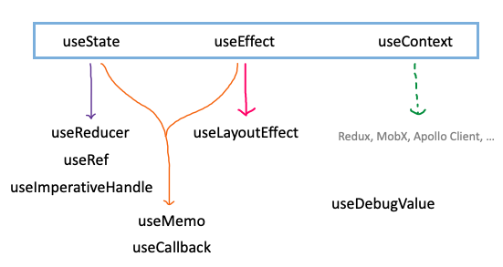
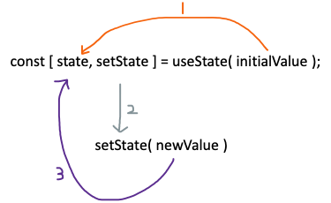
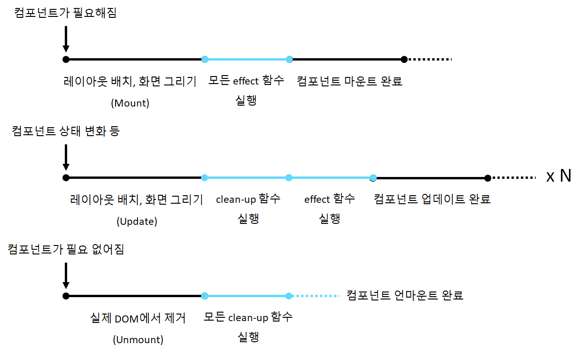
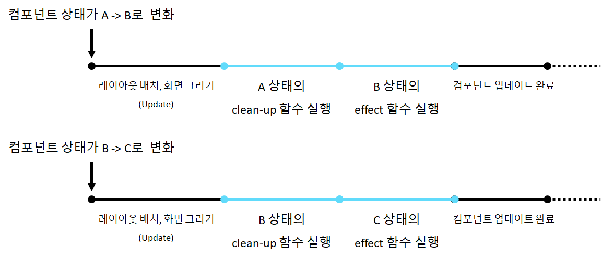
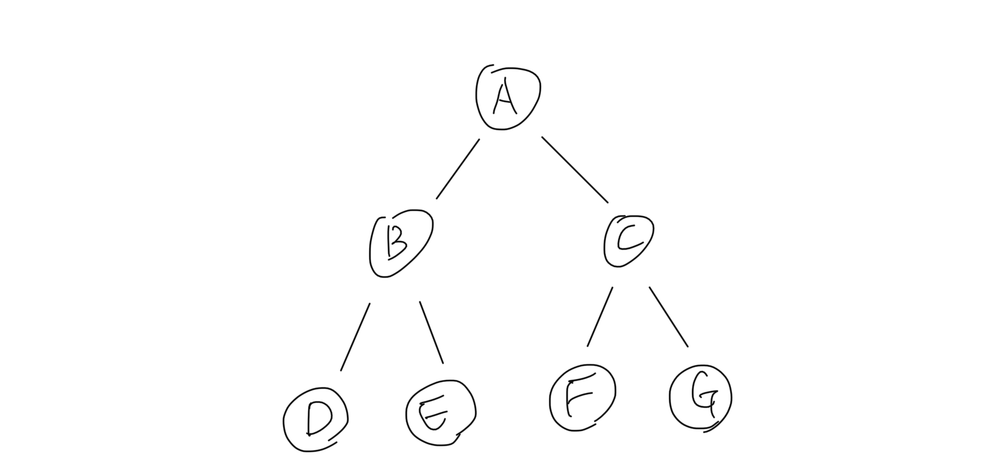
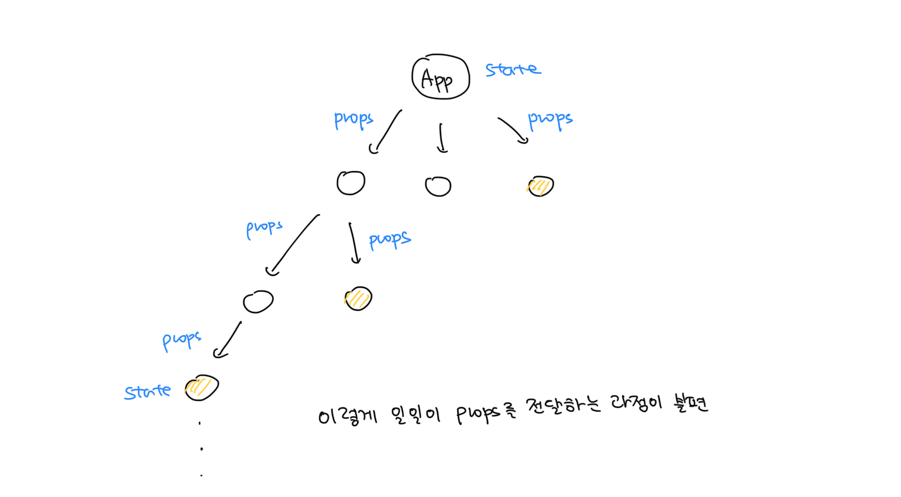
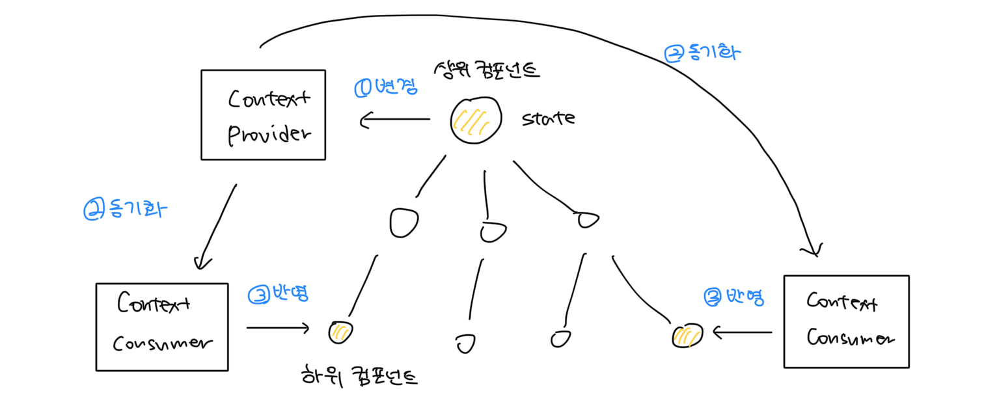
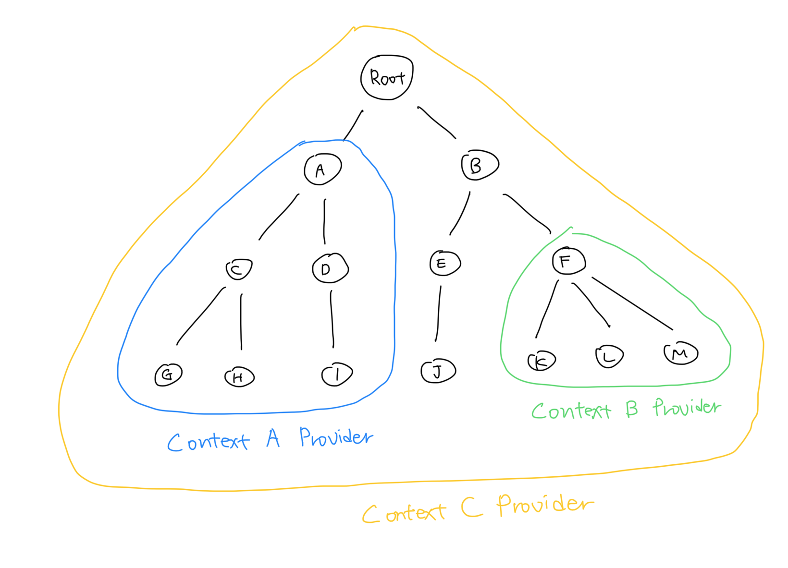
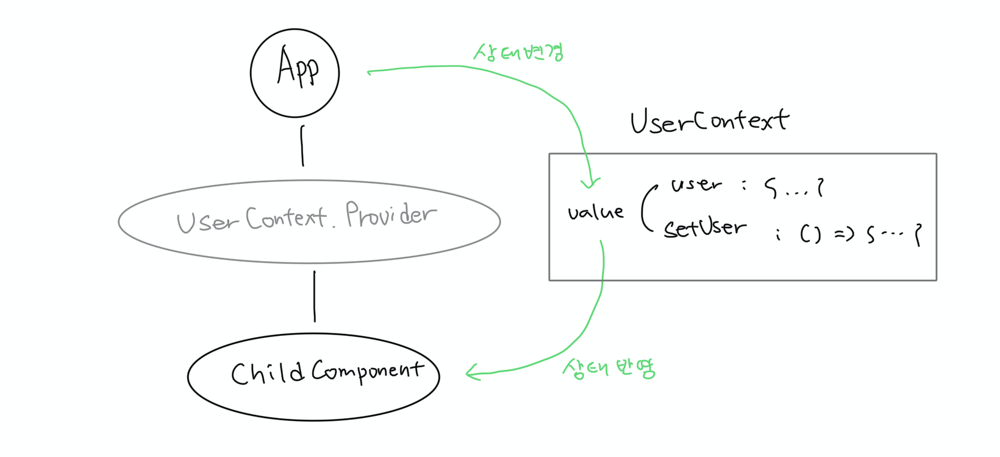

## 개요

React는 v16.8부터 컴포넌트 상태와 컴포넌트 생명주기를 관리할 수 있는 API인 Hook을 제공한다. Hook을 사용하면 함수 컴포넌트도 클래스 컴포넌트처럼 컴포넌트 내부에 상태를 저장할 수 있고 컴포넌트 생명주기에 관여할 수 있다.

React Hooks는 기존 클래스 컴포넌트만 가지고 있던 여러 기능을 지원하기 때문에 함수 컴포넌트를 클래스 컴포넌트처럼 사용할 수 있다. 클래스 컴포넌트와는 다르게 함수 컴포넌트는 모듈화가 쉬워서 React 팀은 앞으로 컴포넌트를 제작할 때 함수 컴포넌트로 만들 것을 권장하고 있다. 그래도 클래스 컴포넌트에 대한 지원을 [끊을 계획이 없다](https://ko.reactjs.org/docs/hooks-faq.html#do-i-need-to-rewrite-all-my-class-components)고 하니까 굳이 시간 들여서 기존 클래스 컴포넌트를 함수 컴포넌트로 리팩토링할 필요는 없다.

하지만 아직 함수 컴포넌트에서만 사용할 수 있는 React Hook이 클래스 컴포넌트의 모든 기능을 대체하진 못한다. 대표적으로 클래스 컴포넌트에서 쓰이는 `getSnapshotBeforeUpdate`와 `getDerivedStateFromError`, `componentDidCatch` 생명주기 메소드는 React Hook에서 지원하지 않는다. 하지만 저 생명주기 메소드는 일반적으로 사용하는 경우가 드물어서 함수 컴포넌트가 클래스 컴포넌트의 기능을 거의 대체했다고 봐도 무방하다. 그리고 React에선 앞으로 저 생명주기 메소드를 구현한 Hook도 [개발할 예정](https://ko.reactjs.org/docs/hooks-faq.html#do-hooks-cover-all-use-cases-for-classes)이라고 한다.



위 그림과 같이 React에선 기본적으로 컴포넌트 상태를 관리할 수 있는 `useState`와 컴포넌트 생애주기에 개입할 수 있는 `useEffect` , 컴포넌트 간의 전역 상태를 관리하는 `useContext` 함수를 제공하고 있다. 그리고 추가로 제공하는 Hook은 기본 Hook의 동작 원리를 모방해서 만들어졌다.

추가 Hook엔 상태 업데이트 로직을 `reducer` 함수에 따로 분리할 수 있는 `useReducer`, 컴포넌트나 HTML 엘리먼트를 레퍼런스로 관리할 수 있는 `useRef`, 그 레퍼런스를 상위 컴포넌트로 전달할 수 있는 `useImperativeHandle`, 의존성 배열에 적힌 값이 변할 때만 값/함수를 다시 정의하는 `useMemo`와 `useCallback`, 모든 DOM 변경 후 브라우저가 화면을 그리기 이전 시점에 동기적으로 실행되는 `useLayoutEffect`, 사용자 정의(custom) Hook의 디버깅을 도와주는 `useDebugValue`가 존재한다.

모든 React Hooks는 함수 컴포넌트에서만 사용할 수 있고, 2020년 9월까진 총 10개의 Hook이 존재하지만 더 추가될 수도 있다.

> 이 글은 React Hook 공식 문서 내용을 어느 정도 이해할 수 있는 사람을 대상으로 쓰여졌습니다. React Hook을 처음 접했다면 이 글을 React 공식 문서와 같이 볼 것을 권장합니다.

## useState



### 사용 방법

`useState`의 첫번째 매개변수로 state의 초기값을 설정한다. 그리고 컴포넌트 상태를 바꾸고 싶을 때마다 `setState` 함수의 첫번째 매개변수로 바꿔줄 값을 넘겨주면 다음 렌더링 시 새로운 상태가 컴포넌트에 반영된다. `setState`의 첫번째 매개변수로 함수를 넘겨주면 그 함수는 이전 상태를 매개변수로 해서 새로운 상태를 반환하는 형태여야 한다. 정리하면 아래와 같다.

1. 초기값이 상태에 반영된다.
2. 변경할 값을 setState 함수의 인수로 넘겨준다.
3. 새로운 값이 상태에 반영된다.

당연하지만 초기 상태값은 컴포넌트 마운트 시에만 상태에 반영되고 컴포넌트를 업데이트 할 땐 무시된다. 하지만 `useState`의 첫번째 매개변수로 함수를 넘겨주면 JavaScript 문법상 매 렌더링 시 그 함수가 실행되어 렌더링 성능이 낮아질 수 있다. 그래서 이 경우에 [고차 함수](https://ko.wikipedia.org/wiki/고차_함수) 형태로 초기값을 계산하면 불필요한 연산을 방지할 수 있다. [#React](https://ko.reactjs.org/docs/hooks-reference.html#lazy-initial-state)

### 상태 업데이트 과정

`useState`가 반환하는 함수(setState)를 호출하면 상태를 업데이트할 수 있다. 하지만 setState 함수를 호출한다고 해서 상태가 바로 변경되는 것은 아니다. setState 함수는 상태 업데이트를 비동기로 수행한다. 즉, 상태 업데이트를 나중으로 예약하고 현재 JavaScript 호출 스택이 전부 비워지면 그때 실제로 상태를 업데이트한다.

그리고 `useState`는 기존 상태와 새로운 상태에 차이가 있는지 확인하기 위해 `Object.is` 메소드를 사용한다. 만약 이전 상태와 다음 상태가 같다고 판단되면 `render` 함수 실행과 reconcilation을 수행하지 않는다. `Object.is` 메소드는 `===` 연산자와 기능이 거의 비슷하고 차이점은 다음과 같다. [#Medium](https://medium.com/jung-han/js-2탄-그리고-object-is-e58b72e90443)

### 등장 배경

`useState`는 함수 컴포넌트에서 상태를 생성-수정-저장할 수 있도록 도와준다. `useState`가 제공하는 상태라는 개념은 JavaScript 함수 내 지역 변수와 비슷한 개념으로, 컴포넌트가 마운트되고 언마운트될 때까지 유지되는 값이다. 하지만 JavaScript의 지역 변수는 함수가 반환되면 값이 사라진다는 점에서 컴포넌트 상태와 다르다.

React 컴포넌트 내부에서 선언한 지역 변수는 컴포넌트가 렌더링되고 다시 렌더링되기 전까지만 유지된다. 그래서 Hook이 등장하기 전엔 함수 컴포넌트에선 상태를 따로 저장하고 유지할 수 없었다. 왜 컴포넌트 내부에 선언한 지역 변수 값은 컴포넌트를 업데이트(렌더링)할 때마다 유지되지 않을까?

기본적으로 JavaScript 함수 내부에 선언된 지역 변수는 함수가 반환되면 사라진다. 그리고 React는 컴포넌트 상태(클래스 컴포넌트의 `this.state` 또는 함수 컴포넌트의 `useState`)가 변경되면 기본적으로 해당 컴포넌트부터 모든 자식 컴포넌트까지 `render` 함수를 실행하고 reconcilation을 수행한다.

> 함수 컴포넌트에서 `render` 함수는 함수 컴포넌트 자체이다.

이 상황에서 컴포넌트에 정의된 지역 변수는 매 `render` 함수가 실행될 때마다 다시 계산되고 할당된다. 그래서 컴포넌트 내부에서 지역 변수 값을 변경해도 다음 렌더링 시 항상 처음에 할당해 준 값이 나오는 것이다. 그래서 컴포넌트의 지역 변수는 어떤 변수의 alias를 설정하는 등 임시 값을 저장하는 용도로 사용하는 것이 좋다. 컴포넌트 지역 변수는 컴포넌트 내부에서만 의미 있게 사용될 수 있다.

### 지역 변수 사용 시 문제점

```tsx
function Counter() {
  let count = 0

  return (
    <>
      {/* '+1 증가' 버튼을 눌러도 항상 0으로 렌더링된다. */}
      <div>{count}</div>
      
      {/* 자식 컴포넌트 props도 새로운 값으로 변경되지 않는다. */}
      <ChildComponent count={count} />
      
      {/* 사실 count 값은 증가하긴 한다. 단지 화면에 반영되지 않을 뿐이다. */}
      <button onClick={() => count++}>+1 증가</button>
    </>
  )
}

function ChildComponent({ count }) {
  return <div>{count}</div>
}

export default Counter
```

위 함수 컴포넌트에서 `count` 값은 `+1 증가` 버튼을 클릭할 때마다 변수 값이 1씩 증가하긴 하지만, `render` 함수가 실행되지 않았기 때문에 변경 사항이 화면에 반영되지 않는다. 그리고 React에서 reconcilation을 위해 각 컴포넌트의 `render` 함수를 실행하면 `count` 값은 다시 0으로 초기화되기 때문에 어짜피 `count`를 화면에 보여주는 용도로 사용할 수 없다.

그리고 `count` 값을 자식 컴포넌트에 props로 전달해도 `render` 함수가 실행되지 않았기 때문에 부모 컴포넌트의 `count` 값이 변했지만 자식 컴포넌트 props 값은 변하지 않는다.

이와 같은 이유로 지역 변수로는 함수 컴포넌트의 상태를 관리할 수 없기 때문에 `useState` Hook이 등장했다.

### 사용 예시

```ts
import { useState } from 'react'

function App() {
  const [id, setId] = useState('')
  const [password, setPassword] = useState('')
  const [email, setEmail] = useState('')
  const [name, setName] = useState('')

  ...
}

export default App
```

위와 같이 `useState`를 여러 번 사용해서 여러 개의 상태를 관리할 수 있다.

```ts
import { useState } from 'react'

function App() {
  const [signupData, setSignupData] = useState({
    id: '',
    password: '',
    email: '',
    name: '',
  })

  ...
}

export default App
```

또는 위와 같이 `useState`에 객체를 전달해서 여러 개의 상태를 관리할 수도 있다.

중요한 점은 비슷한 것은 객체로 묶어 놓고, 공통점이 없는 것끼린 분리해서 각 상태의 [책임을 분산](https://ko.wikipedia.org/wiki/단일_책임_원칙)해야 한다는 것이다. 이래야 모듈화도 쉬워지고 불필요한 큰 객체 생성을 방지할 수 있다. 여기서의 책임은 변화를 의미하는데, 서로 같이 업데이트되는 상태끼린 한 객체로 묶어도 된다는 뜻이다. 예를 들면 `마우스 x, y 좌표` 상태는 각각 관리하는 것보단 한 객체로 묶어서 관리하는 것이 효율적이고, 위와 같은 회원가입 데이터는 각각 따로 관리하는 것이 좋다.

만약 상태 업데이트 로직이 복잡하다면 `useReducer`를 활용해서 해당 컴포넌트로부터 상태 업데이트 로직을 분리하는 것이 컴포넌트 유지 보수 측면에서 좋다고 한다.

### 주의할 점

`useState`는 상태를 값(value)으로 관리한다. 만약에 상태를 객체로 설정하고 해당 객체에 레퍼런스로 접근해서 필드 값을 변경하면 객체 필드 값은 실제로 변경되지만 이를 React가 알 수 없어 변경 사항이 화면에 반영되지 않는다. 그렇기 때문에 `useState`의 상태를 변경할 땐 항상 **`useState`에서 제공하는 함수를 사용해야** 한다.

`useState`는 상태 변경을 감지할 때 `Object.is` 메소드로 판단한다. 그래서 만약 객체의 property를 `=` 연산자를 통해 변경할 경우, React에서 객체 레퍼런스는 동일하기 때문에 이전 상태와 현재 상태를 같다고 판단할 수 있다. 그래서 `useState`로 객체를 관리할 땐 항상 **immutable하게 관리하고,** 객체 property 값을 수정할 필요가 있을 땐 새로운 객체를 생성해서 기존 값을 새로운 객체에 복사하는 형식으로 관리해야 한다.

`useState`는 상태 업데이트 로직을 비동기로 실행하기 때문에 기존 명령형 프로그램에서 변수 선언-할당-접근과 달리 상태가 상태 업데이트 함수를 호출한 다음 줄에서 바로 업데이트되지 않는다. 상태 업데이트 후 코드를 실행하고 싶으면 아래와 같이 `useEffect`를 사용한다. [#StackOverflow](https://stackoverflow.com/questions/54069253/usestate-set-method-not-reflecting-change-immediately)

```tsx
import { useState } from 'react'

function Counter() {
  const [state, setState] = useState(0)
  
  function handleClickButton() {
    console.log(state) // 기존 상태 출력
    setState(prev => prev + 1)
    console.log(state) // 위와 동일한 값 출력 (+1이 반영되지 않은 값)
  }
  
  useEffect(() => {
    console.log(state) // +1이 반영된 값 출력
  }, [state])
    
  return (
    <>
      <div>{state}</div>
      <button onClick={handleClickButton}>+1</button>
    </>
  )
}

export default Counter
```

> `useRef`는 상태 업데이트를 동기로 진행하기 때문에 변경 사항이 바로 반영된다.

## useEffect

`useEffect`를 사용하면 컴포넌트를 화면에 그린 후 실행될 함수를 정의할 수 있다. 그럼 왜 컴포넌트를 화면에 그린 후 함수를 실행해야 될까? 컴포넌트를 그리면서 함수를 실행하거나 그리기 이전에 실행할 순 없을까?

### 등장 배경

기본적으로 JavaScript 런타임은 싱글 스레드로 동작한다. 뭐 브라우저 API나 외부 API 등을 모두 포함하는 브라우저 런타임에선 여러 작업이 병렬적으로 수행되지만, JavaScript 코드를 실행하는 엔진은 싱글 스레드로 동작한다. 그 말은 JavaScript는 호출 스택을 1개 가지고 있고, 1번에 한 작업만 처리할 수 있다는 뜻이다(+ 도중에 스레드 실행을 interrupt 할 수 있는 기능도 없다).

> JavaScript가 멀티 스레드가 아닌 싱글 스레드인 이유는 JavaScript 엔진이 그렇기 때문에 논외로 하자

그래서 어떤 함수를 실행하면 무조건 그 함수가 모두 실행되고 정상적으로 반환될 때까지 다른 작업을 수행할 수 없다. 그러면 도대체 어떻게 싱글 스레드로 화면을 끊김 없이 렌더링할 수 있는 것일까?

그건 동영상도 1초에 여러 사진을 보여주는 방식으로 구성되어 있듯이, 브라우저 화면 렌더링도 1초에 60번씩 수행된다. 즉, 16.6ms 당 렌더링이 1번 수행되기 때문에 이 사이에 JavaScript가 작업을 모두 끝마쳐야 화면이 끊김 없이 렌더링될 수 있다(화면 렌더링 시간도 포함하면 16.6ms보다 더 짧긴 하다). 만약 JavaScript가 16.6ms 안에 작업을 끝마치지 못하면 그때마다 화면 렌더링이 뒤로 밀려날 것이고, 이런 상황이 많이 발생하면 사용자는 브라우저가 느리다고 인식하게 될 것이다.

그래서 JavaScript는 이런 상황을 방지하기 위해서 비동기(asynchronous)라는 개념을 도입했다. JavaScript에서 함수를 비동기로 실행한다는 것은 함수의 실행을 적절하게 나중으로 예약한다는 뜻이다.

브라우저에선 외부 서버에서 데이터를 가져오는 작업이 빈번하게 발생하는데 JavaScript는 싱글 스레드이기 때문에 서버 응답을 하염없이 기다릴 순 없다. 그래서 `fetch` 함수는 서버로부터 응답을 받은 후 실행될 코드(이를 보통 콜백 함수라고 부른다)를 나중으로 미룬 후 다른 작업을 먼저 처리하고, 응답을 받으면 그때 콜백 함수를 실행하는 방식으로 구현되어 있다.

그리고 만약 어떤 함수의 실행이 16.6ms 보다 오래 걸리면 이 함수를 적절히 n등분해서 매 랜더링 시점 사이에 실행시키면 화면 렌더링이 뒤로 밀리는 일 없이 함수가 실행될 수 있을 것이다. 물론 이렇게 함수를 나눠서 실행하면 한번에 실행하는 것보다 총 실행 시간은 길어지겠지만, 그대신 화면 버벅거림이 줄어들기 때문에 사용자는 실질적으로 빠르다고 느낄 것이다.

그래서 이런 효과를 보기 위해 `useEffect`가 존재하고, 이런 이유 때문에 화면 렌더링이 끝난 후 effect 함수와 clean-up 함수를 실행하는 것이다.

### 사용 방법

```js
// 매개변수 1개 (함수)
useEffect(() => {
  console.log("component did mount or update")
  return () => {
    console.log("component will unmount or update")
  }
})

// 매개변수 2개 (함수 + 빈 배열)
useEffect(() => {
  console.log("component did mount")
  return () => {
    console.log("component will unmount")
  }
}, [])

// 매개변수 2개 (함수 + 배열)
useEffect(() => {
  console.log("component did (mount or update) and states changed")
  return () => {
    console.log("component will (unmount or update) and states changed")
  }
}, [state, state2, ...])
```

`useEffect`는 위 그림과 같이 사용할 수 있다. `useEffect`는 2개의 매개변수를 가지는데 첫번째는 컴포넌트 레이아웃 배치와 화면 그리기가 끝난 후 실행될 함수이고, 두번째는 의존성 배열이다. 첫번째 인자의 내부는 effect 함수라고 부르고, 첫번째 인자가 반환하는 함수는 clean-up 함수라고 부른다.

`useEffect`는 첫번째 인자로 주어진 함수를 실행하기 전에 의존성 배열의 원소가 변경됐는지 확인한다. 비교는 `useState`와 동일하게 `Object.is` 메소드를 사용하고 만약 하나도 변경되지 않았으면 그 렌더링 시점에선 `useEffect`를 실행하지 않는다. 하지만 의존성 배열의 원소가 하나라도 변경됐으면 `useEffect`를 실행한다.

이런 원리로 인해 의존성 배열을 빈 배열로 설정하면 해당 `useEffect`의 함수는 컴포넌트를 마운트하는 시점과 언마운트하는 시점에만 실행된다.

### 함수 컴포넌트 생애주기



`useEffect`가 함수 컴포넌트 생애주기에 관여하는 부분은 위 그림과 같고, `useEffect`는 항상 DOM 상태 변경과 레이아웃 배치, 화면 그리기가 모두 완료된 후 실행된다는 특징이 있다.

컴포넌트는 기본적으로 `마운트->업데이트(반복)->언마운트`의 생애주기를 가진다. 마운트 상태는 컴포넌트 구조가 HTML DOM에 존재하는 상태(화면에 보이는 상태)를 의미하고, 컴포넌트 DOM 구조나 내용이 변경될 때마다 업데이트 과정을 거치며, 언마운트 상태는 컴포넌트 구조가 HTML DOM에서 제거된 상태(화면에 안 보이는 상태)를 의미한다.

### effect 함수와 clean-up 함수



React 컴포넌트는 매 `render` 함수를 실행하는 과정에서 그 시점의 컴포넌트 props와 상태를 기반으로 컴포넌트 내부 변수와 함수를 다시 정의하고 계산한다. 이 때 `useEffect`의 첫번째 인수도 계산되어 React 내부 스케줄러에 등록되고 나중에 위 그림에서 표현된 시점에 실행된다.

위 그림과 같이 컴포넌트 상태가 A에서 B로 변경되면 A 상태의 clean-up 함수가 실행되고 B 상태의 effect 함수가 실행된다. 그리고 B 상태의 clean-up 함수는 내부 스케줄러에 의해 다음 effect 함수를 실행하기 전에 실행된다. 이를 활용하면 setTimeout이나 setInterval의 콜백 함수 실행을 취소시킬 수도 있다. 아래 CodeSandbox에서 이런 함수의 실행 시점을 `console.log`를 통해 확인할 수 있다.

> [한 컴포넌트 내에서 여러 effect 함수와 clean-up 함수의 실행 시점 (CodeSandbox)](https://codesandbox.io/s/react-useeffect-executing-order-in-a-component-3t8d2?file=/src/App.js)

### 여러 컴포넌트에서의 실행 순서

`useEffect`의 effect 함수나 clean-up 함수는 기본적으로 해당 컴포넌트가 모두 화면에 그려진 후 실행된다. 그럼 깊은 트리 구조를 가진 여러 컴포넌트가 모두 `useEffect`를 사용하면 `useEffect`의 실행 순서는 어떻게 될까?



위 그림과 같이 A 컴포넌트를 루트 컴포넌트로 한 트리 구조에서 모든 컴포넌트에 `useEffect`의 effect 함수와 clean-up 함수를 가지고 있다고 가정하자. 우선 모든 컴포넌트가 마운트되는 순서는 아래와 같다.

D ⭢ E ⭢ B ⭢ F ⭢ G ⭢ C ⭢ A (컴포넌트 마운트 순서)

왜나하면 React 컴포넌트도 결국 함수이고 JSX 문법도 컴파일되면 `_jsx` 함수로 변경되기 때문이다(React 17 기준). 그래서 먼저 호출된 함수가 먼저 스택에 쌓이고 마지막에 없어지듯이, 가장 먼저 호출된 A 컴포넌트가 가장 마지막에 마운트된다.

> React 컴포넌트는 `ReactDOM.render` 함수의 첫번째 인수로 주어진 컴포넌트부터 차례대로 렌더링되는데 보통 여기에 `<App />` 컴포넌트가 위치한다.

D ⭢ E ⭢ B ⭢ F ⭢ G ⭢ C ⭢ A (effect 함수 실행 순서)

그래서 effect 함수도 컴포넌트 마운트 순서를 똑같이 따라간다. effect 함수와 clean-up 함수의 정확한 실행 순서는 아래 CodeSandbox에서 `console.log`를 통해 확인할 수 있다.

> [여러 컴포넌트에서 effect 함수와 clean-up 함수의 실행 시점 (CodeSandbox)](https://codesandbox.io/s/react-useeffect-executing-order-in-nesting-components-urtrc?file=/src/App.js)

## useContext

React Context는 Redux 등과 비슷하게 여러 컴포넌트 간 상태를 효율적으로 공유할 수 있는 API를 제공한다.



일반적인 React에서 데이터는 위에서 아래로(상위 컴포넌트에서 하위 컴포넌트로) props를 통해 전달되지만, 위 그림과 같이 App 컴포넌트에서 노란색 컴포넌트로 상태를 전달하고 싶은데 노란색 컴포넌트가 너무 깊이 있을 경우 props를 통해 중간 컴포넌트에 일일이 전달하는 과정이 번거로울 수 있다.



이때 Context를 이용하면 각 컴포넌트에게 데이터를 명시적으로 props로 넘겨주지 않아도 컴포넌트끼리 데이터를 공유할 수 있다. Context는 Provider와 Consumer로 이뤄지는데, MVC 패턴이나 Observer 패턴과 비슷하게 Provider의 값이 변경되면 Consumer가 이를 감지하고 자동으로 하위 컴포넌트에 변경 사항을 반영해준다.

React v16.3 이상에선 Context를 기본적으로 지원하기 때문에 따로 설치하지 않아도 된다. 그리고 함수 컴포넌트에선 Context Consumer로서 `useContext`를 사용할 수 있다.

### 원리



컴포넌트 트리 구조와 각 context provider의 범위가 위와 같다면 각 Context Provider의 위치는 아래와 같다.

- Context A Provider는 A 컴포넌트를 감싸고 있다.
- Context B Provider는 F 컴포넌트를 감싸고 있다.
- Context C Provider는 Root 컴포넌트를 감싸고 있다.

컴포넌트 별 각 Context에 접근할 수 있는 권한은 아래와 같다.

- Root 컴포넌트는 Context C에만 접근할 수 있다.
- A 컴포넌트는 Context A, C에 접근할 수 있다.
- B 컴포넌트는 Context C에만 접근할 수 있다.
- G 컴포넌트는 Context A, C에 접근할 수 있다.
- J 컴포넌트는 Context C에만 접근할 수 있다.
- K 컴포넌트는 Context B, C에 접근할 수 있다.

### 코드 예시



#### Context 생성

```ts
// src/UserContext.ts
import { createContext } from 'react'

type User = Record<string, unknown>

type UserContextValue = {
  user: User;
  setUser: (user: User) => void;
}

const UserContext = createContext<UserContextValue>(null)

export default UserContext
```

`createContext` 함수를 통해 사용자 정보와 그 정보를 변경할 수 있는 함수를 공유하는 React Context를 생성한다. 이 Context는 `user`라는 변수와 `setUser`라는 함수를 가지고 있어서, user에 사용자 정보를 저장하고 setUser 함수로 하위 컴포넌트에서 user 정보를 변경할 수 있다.

#### Context 제공

```tsx
// src/App.tsx
import { useState } from 'react'
import UserContext from './UserContext'

function App() {
  const [user, setUser] = useState(null)

  return (
    <UserContext.Provider value={{ user, setUser }}>
      <ChildComponent />
    </UserContext.Provider>
  )
}

export default App
```

그리고 상태를 공유할 컴포넌트의 공통 조상 컴포넌트를 `Context.Provider`로 감싸면 `Context.Provider`의 모든 자식 컴포넌트는 value 값에 접근할 수 있게 된다. 그래서 Context를 사용하면 컴포넌트 트리가 깊을 때 한 컴포넌트가 다른 컴포넌트로 데이터를 전달하기 위해 중간에 여러 컴포넌트에게 props를 일일이 전달하지 않아도 된다.

Context Provider는 React 트리 아무 곳에 배치할 수 있는데 Context Provider 밖에선 해당 Context에 접근할 수 없다는 점만 주의해서 위치를 정한다.

#### Context 접근

```tsx
// src/ChildComponent.tsx
import { useContext } from 'react'
import UserContext from './UserContext'

function ChildComponent() {
  const userContext = useContext(UserContext)

  return (
    <div>
      <button onClick={() => {
          userContext.setUser({ name: '이름' })
        }
      />
      <div>User name: {userContext.user.name}</div>
    </div>
  )
}

export default ChildComponent
```

Context Provider의 하위 컴포넌트라면 `useContext` hook을 통해 해당 Context 상태를 구독할 수 있다. `useContext` hook은 인수로 지정한 context의 value를 그대로 반환한다. Context Consumer 패턴으로도 context value에 접근할 수 있는데 일반적으로 `useContext` hook을 많이 사용한다.

만약 `UserContext.Provider`의 value가 변경되면 기존 value 값과 새로운 value 값에 대해 얕은 비교를 수행하고, 다르면 해당 context를 구독하는 모든 컴포넌트(+그의 자식 컴포넌트)의 `render` 함수가 실행된 후 reconcilation이 일어난다.


원문 - https://velog.io/@gwak2837/React-Hooks%EC%9D%98-%EC%9D%B4%ED%95%B4